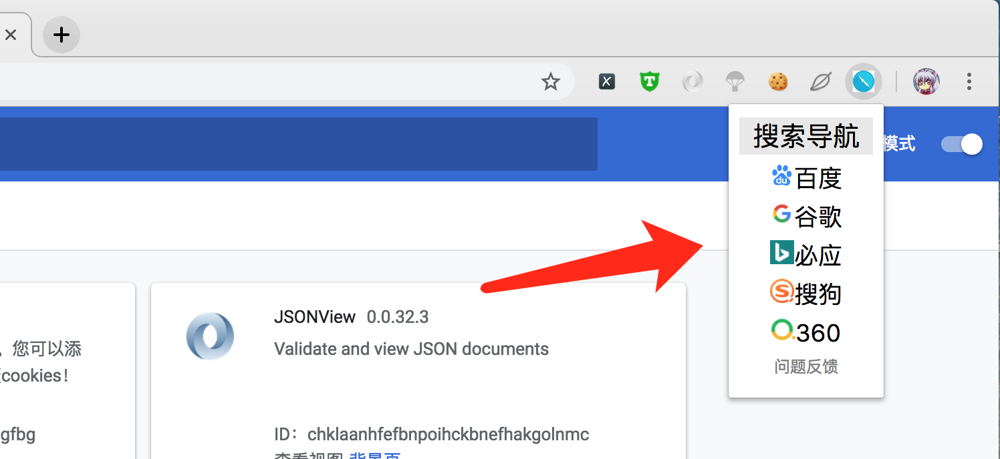
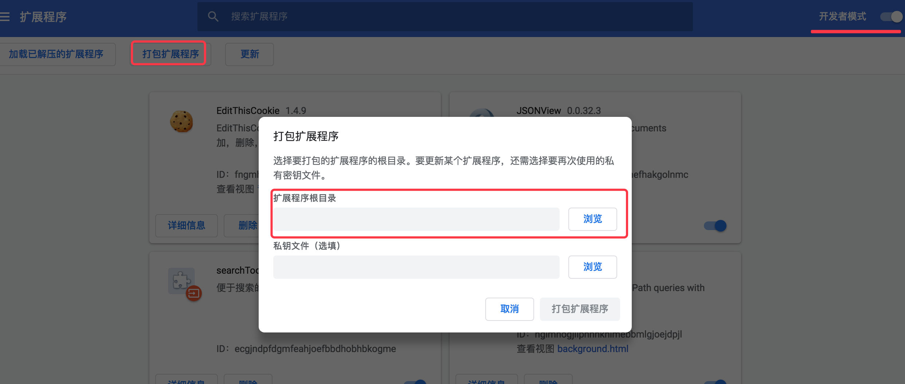

# Chrome extension demo

How to use: download crx file, put it into chrome extension page

## write a simple chrome extension

1. 实现效果：



2. 简单理解：chrome扩展程序就是一个web应用，小型网站，只不过是在chrome上多了个快捷方式

3. 必备知识(初级即可)：
```
html
css
javascript
```

4. 必备工具: chrome浏览器（本次使用的版本是 69）

# 第一步：初始化项目

项目文件说明：

```
chrome-search-tool/
    ├── manifest.json       # 配置文件
    ├── popup.html          # 弹出窗口
    ├── icon.png            # 扩展图标
    └── images              # 静态资源文件(如images、css、js等)
```

# 第二步：编写配置文件

manifest.json

```json
{  
  "name": "searchTool",  
  "manifest_version":2,
  "version": "0.0.1",  
  "description": "便于搜索的chrome插件",
  "browser_action": {  
    "default_icon": "icon.png" ,
    "default_title": "搜索集合工具",
    "default_popup": "popup.html"
  }  
}
```

参数说明:

1. name 插件名称  
2. version 插件的版本号  
3. manifest_version 指定清单文件格式的版本, 2就OK了  
4. description 插件描述  
5. icons 插件图标，PNG格式， 需准备三个图标文件:
    16x16（扩展信息栏） 
    48x48（扩展管理页面） 
    128x128（用在安装过程中） 
6. default_locale 国际化支持，支持何种语言的浏览器，虽然官方推荐，不过我没用

# 第三步：编写popup页面

```html
<meta charset="utf8">
<base target="_blank" />
<style>
    .main{
        width: 100px;
        height: 200px;
        font-size: 18px;
        text-align: center;
    }
    a{
        text-decoration: none;
    }
    .title{
        width: 100%;
        font-size: 20px;
        background-color: #E8E8E8;
    }
    img{
        width: 18px;
        height: 18px;
    }
    .links{
        margin-top: 5px; 
    }
    .links a{
        width: 100%;
        display: block;
        margin: 4px 0;
        
        color: black;
        line-height: 25px;

    }
    .links a:hover{
        background-color: red;
        color: white;
    }
    .links img{
        line-height: 25px;
    }
    .footer a{
        font-size: 12px;
        color: grey;
    }
</style>  

<div class="main">
    <div class="title">搜索导航</div>

    <div class="links">
        <a href="https://www.baidu.com/">百度</a>
        <a href="https://www.google.com.hk/">谷歌</a>
        <a href="https://cn.bing.com/">必应</a>
        <a href="https://www.sogou.com/">搜狗</a>
        <a href="https://www.so.com/">360</a>
    </div> 
    <div class="footer">
        <a href="https://www.pengshiyu.com/message.html">问题反馈</a>
    </div>

</div>
```

其实就是html + css + javascript

备注：如果出现中文乱码，记得在文件顶部加入`<meta charset="utf8">`，此方法和html编码是一样的，没有什么特别之处


# 第四步：配置图标

可以百度图片上找一张方块图片，最好找png格式的  

对于简单的尺寸大小的裁剪，可以到这个网址处理：http://www.gaitubao.com/


# 第五步：打包安装扩展程序
打开Chrome –> 更多工具 –> 扩展程序 -> 打开“开发者模式” 

有两个方法：
1. 加载已解压的扩展程序 -> 将文件夹`chrome-search-tool` 拖入就行（多用于调试，修改文件后刷新即可）
2. 打包扩展程序 -> 选择打包扩展程序文件夹的路径 -> 生成crx扩展名的文件 -> 拖入chrome




>参考文章:
>[编写一个简单的chrome插件](https://blog.csdn.net/lilian1131/article/details/79171125)

